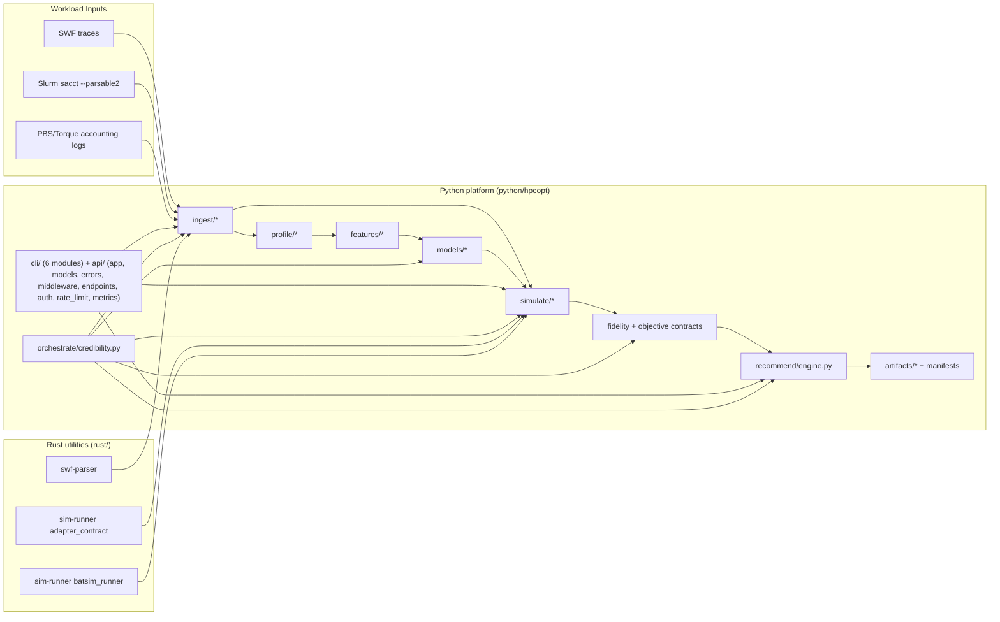
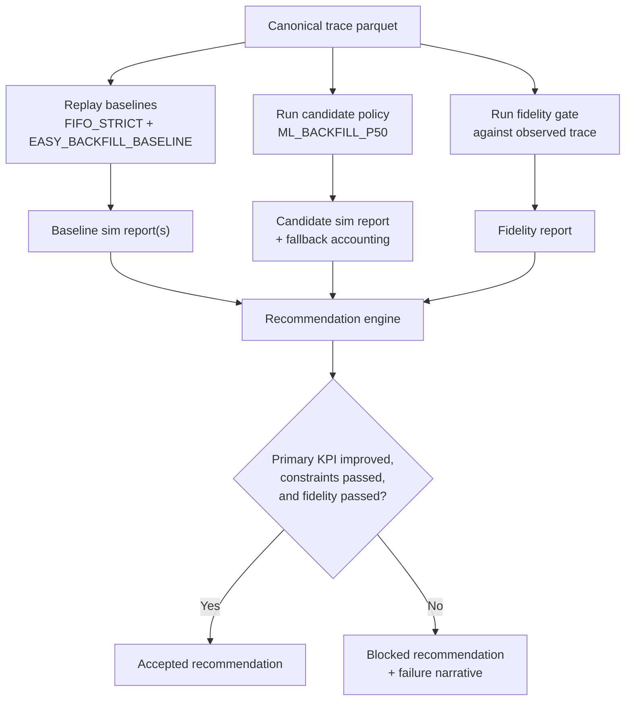
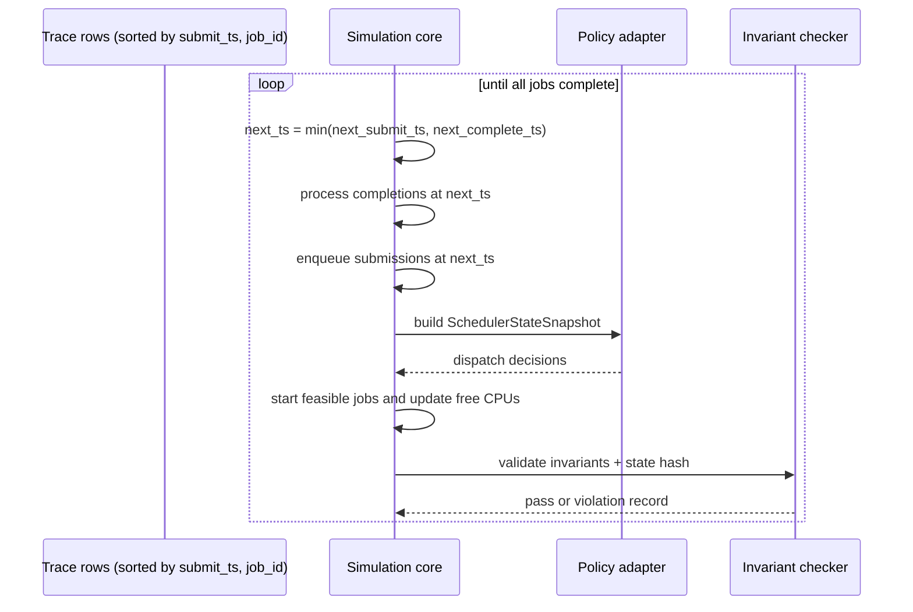
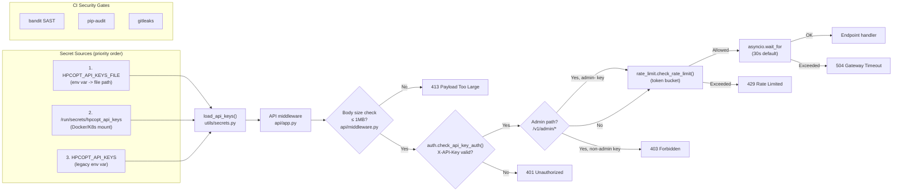
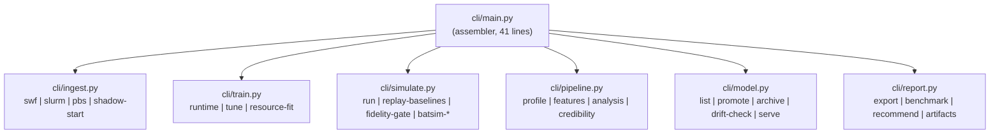
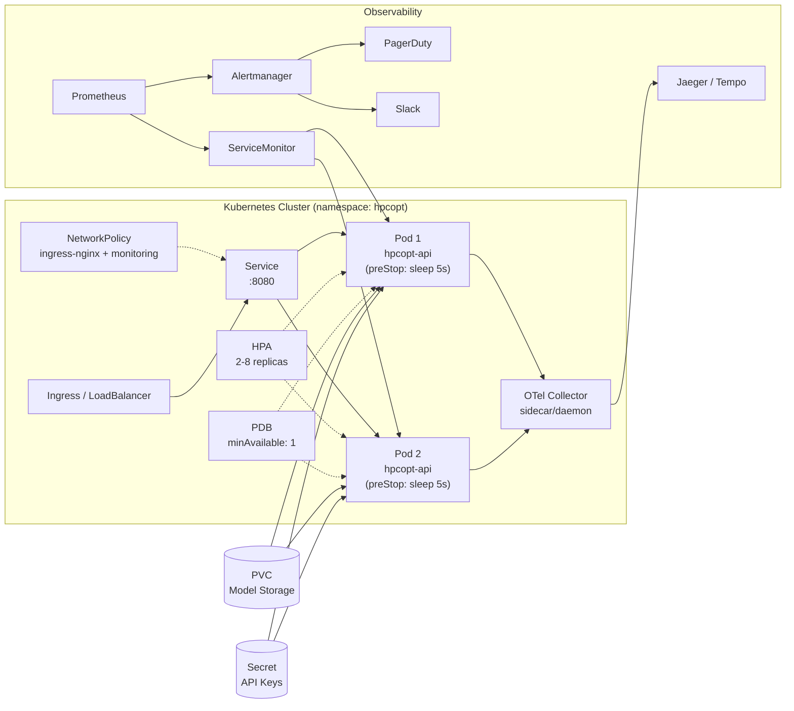
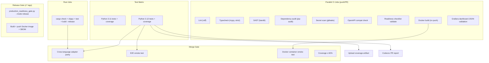

# HPC Workload Optimizer

[](https://github.com/ErenAri/HCP-workload-optimizer/actions/workflows/ci.yaml)
[](https://codecov.io/gh/ErenAri/HCP-workload-optimizer)
[](https://www.python.org/downloads/)
[](https://github.com/astral-sh/ruff)
[](LICENSE)

Systems-first HPC scheduling research and engineering platform (Python + Rust) focused on reproducible policy evaluation under uncertainty.

## Abstract

HPC Workload Optimizer (HPCOpt) targets a persistent operations problem in shared compute clusters: queue delay and resource waste caused by static scheduling heuristics and uncertain job runtime requests.
The project does not frame this as a standalone runtime prediction task. Instead, it builds a contract-driven decision and evaluation stack where:

- scheduler behavior is explicitly specified,
- replay is deterministic,
- invariants are executable,
- policy claims are gated by fidelity,
- recommendations are constrained by fairness and starvation bounds.

This design is meant to satisfy advanced systems engineering credibility requirements, not only model accuracy requirements.

## Primary Objective

Construct an advisory control layer that can demonstrate measurable scheduling improvements in simulation while preserving policy safety and reproducibility.

Operational target:

- improve primary queueing objective (`p95 BSLD`),
- maintain or improve utilization,
- avoid fairness/starvation regressions,
- produce auditable artifacts for every claim.

## Why This Project Is Different

Typical scheduling ML demos optimize a single predictive metric. HPCOpt enforces a stronger standard:

- policy-contract-first simulation,
- deterministic transition semantics,
- fidelity checks against observed traces,
- fallback transparency for uncertainty models,
- recommendation acceptance only under hard constraints.

## Implemented Capabilities (Current State)

### Core Pipeline

- Multi-format ingestion (SWF, Slurm `sacct --parsable2`, PBS/Torque accounting logs) with canonical parquet export and quality reporting.
- Reference-suite trace hash locking and enforcement.
- Trace profiling for heavy-tail, congestion, over-request, and user-skew analysis.
- Time-safe feature engineering pipeline with chronological cross-validation splits.
- Runtime quantile modeling (`p10/p50/p90`) with monotonic inference enforcement.
- Runtime baseline-lift reporting against naive comparators (global mean/median and user-history median).
- Resource-fit modeling: fragmentation risk classifier + optimal node size regressor.

### Simulation and Evaluation

- Deterministic simulation core for `FIFO_STRICT`, `EASY_BACKFILL_BASELINE`, and `ML_BACKFILL_P50`.
- Invariant reporting with strict-fail mode.
- Baseline fidelity gate (aggregate + distribution + queue-correlation checks).
- Stress scenario generation (heavy-tail, low-congestion, user-skew, burst-shock) and automated stress testing.
- Recommendation engine with primary KPI gating, fairness/starvation constraints, Pareto multi-objective mode, and failure-mode narratives.
- Benchmark suite with parse/simulation/pipeline throughput metrics, history ledger, and regression gate.
- Batsim integration path: config generation, run invocation (native/WSL), output normalization, optional candidate fidelity report.

### Model Management and Operations

- Model registry (append-only JSONL) with register/promote/archive lifecycle.
- Drift detection: Population Stability Index (PSI) per feature and pinball loss degradation tracking.
- Hyperparameter tuning with random search and chronological cross-validation.
- Feature importance analysis via permutation importance.
- Shadow ingestion daemon for incremental Slurm/PBS polling with watermark persistence.
- Artifact retention management with production-model and dossier-reference protection.

### Credibility and Reproducibility

- Full credibility protocol: automated multi-trace suite runs with per-trace fidelity, sensitivity, and recommendation outcomes.
- Credibility dossier assembly (JSON + markdown) with cross-trace summary.
- Policy sensitivity sweeps over guard coefficient (`k`) parameter space.
- Immutable run manifest generation with hashes, config snapshots, seeds, and environment fingerprints.
- Artifact export bundles (JSON + markdown).

### Deployment and Observability

- Production-ready API (FastAPI) with runtime and resource-fit prediction endpoints, recommendation retrieval, fully modular architecture: `api/app.py` (assembler), `api/models.py` (Pydantic schemas), `api/errors.py` (RFC 7807 handlers), `api/middleware.py` (auth/rate-limit/timeout pipeline), `api/endpoints.py` (route handlers), `api/auth.py`, `api/rate_limit.py`, `api/model_cache.py`, `api/deprecation.py`, `api/metrics.py`, `api/tracing.py`.
- **Request body size limit** (1MB middleware) and **Pydantic input bounds** (le=, max_length=, extra="forbid") on all request models.
- File-based API key authentication with 3-tier loading (file env var, Docker secret mount, legacy env var) and rotation without restart (`api/auth.py`). **Admin RBAC**: `admin-` prefixed API keys required for `/v1/admin/*` paths.
- Model cache pre-warming at startup for faster cold-start response times (`api/model_cache.py`).
- Configurable request timeout (default 30s via `HPCOPT_REQUEST_TIMEOUT_SEC`) with 504 Gateway Timeout response.
- **Circuit breaker** on prediction path (5-failure threshold, 60s reset, fallback on open).
- **RFC 7807 Problem Details** error responses with `type`, `title`, `status`, `detail`, `instance` fields.
- **Model card generation** (`models/model_card.py`): dataset characteristics, performance metrics, fairness/bias evaluation, limitations.
- **Startup config validation**: validates environment variables at API startup with fail-fast on invalid config.
- Prometheus metrics: request counters, latency histograms, fallback rates, model status gauges, `rate_limit_rejections_total`, `auth_failures_total`, `cache_hits_total`, `model_load_duration_seconds`.
- Grafana dashboard (8 panels: request rate, latency percentiles, error rate, model status, heatmap).
- Structured JSON logging with correlation ID propagation.
- Docker containerization with multi-stage build, pinned base image digests, and Docker secrets support.
- **Kubernetes manifests**: Deployment (health/readiness probes, security context, resource limits, preStop hook for connection draining), Service, ConfigMap, Secret, HPA (2-8 replicas), ServiceMonitor, OpenTelemetry Collector, Alertmanager, PodDisruptionBudget (minAvailable: 1), NetworkPolicy (ingress from ingress-nginx + monitoring only).
- GitHub Actions CI/CD: lint, typecheck, test matrix (Python 3.11/3.12), coverage gate (82%), E2E smoke test, Codecov reporting, Rust check/clippy, cross-language parity, bandit SAST, dependency audit, secret scanning, Docker build, and release workflows.
- JSON Schema validation for all configuration files with `additionalProperties: false` enforcement.
- **OpenTelemetry** distributed tracing with configurable sampling per environment.
- **API deprecation sunset mechanism** with RFC 8594/9745 `Sunset` and `Deprecation` response headers.
- **SLO and error budget** policy with PagerDuty (critical) and Slack (warning) alert routing.

### Cross-Language

- Rust utilities for parser stats and scheduler adapter contract parity.
- Rust release profile with LTO, strip, single codegen unit, and saturating arithmetic for overflow safety.
- Mandatory cross-language adapter parity test in CI (Python/Rust decision equivalence).

## Architecture

```text
Raw traces (SWF / Slurm sacct / PBS accounting)
  -> Canonical ingestion (parquet + quality report)
  -> Trace profiling
  -> Feature engineering + chronological splits
  -> Runtime quantile training (+ tuning + importance analysis)
  -> Resource-fit training
  -> Policy replay (native core and Batsim-normalized path)
  -> Fidelity + objective contract evaluation
  -> Stress testing across synthetic scenarios
  -> Recommendation generation (single-objective or Pareto)
  -> Credibility dossier assembly
  -> Exportable artifacts with immutable manifests
```

Language partition:

- Python: orchestration, simulation logic, ML, fidelity, recommendations, CLI/API, observability.
- Rust: SWF parser utility, deterministic runner scaffolding, adapter contract parity binary.

### Architecture Diagrams

#### 1) Component and language boundary view



#### 2) Policy evaluation and recommendation gate



#### 3) Deterministic simulation event loop



#### 4) Credibility suite orchestration path

```mermaid
flowchart LR
  REF["configs/data/reference_suite.yaml"] --> SUITE["run_suite_credibility"]
  SWEEP["configs/credibility/default_sweep.yaml"] --> SUITE
  RAW["data/raw/*.swf.gz"] --> SUITE

  SUITE --> LOOP{"for each reference trace"}
  LOOP --> ING2["ingest_swf"]
  ING2 --> PRO2["build_trace_profile"]
  PRO2 --> FEAT2["build_feature_dataset"]
  FEAT2 --> TRAIN2["train_runtime_quantile_models"]
  TRAIN2 --> BASE2["simulate FIFO/EASY baselines"]
  BASE2 --> CAND2["simulate ML candidate"]
  CAND2 --> FID2["run_baseline_fidelity_gate"]
  FID2 --> REC2["generate_recommendation_report"]
  REC2 --> MAN2["build_manifest"]
  MAN2 --> OUT2["outputs/credibility/[trace_id]/..."]
  OUT2 --> SUM2["credibility_suite_summary.json"]
```



#### 5) Security and secrets architecture



#### 6) CLI module architecture



## Repository Map

```text
python/hpcopt/
  cli/           # Typer command surface (modular: ingest, train, simulate, report, pipeline, model)
  api/           # FastAPI service (modular: app assembler + models, errors, middleware, endpoints, auth, rate_limit, model_cache, deprecation, metrics, tracing)
  ingest/        # SWF, Slurm, PBS parsers + shadow ingestion daemon
  profile/       # Trace profiling and workload characterization
  features/      # Time-safe feature pipeline + chronological splits
  models/        # Runtime quantile, resource-fit, drift, tuning, registry, model card
  simulate/      # Policy core, adapter, fidelity, Batsim, stress scenarios
  recommend/     # Recommendation engine with Pareto mode
  artifacts/     # Manifests, export, benchmarks, credibility dossier, retention
  analysis/      # Sensitivity sweeps, feature importance
  orchestrate/   # Credibility protocol orchestrator
  utils/         # I/O, structured logging, config validation, file-based secrets
  py.typed       # PEP 561 marker for downstream type checking

rust/
  swf-parser/    # Fast SWF line parser/statistics utility
  sim-runner/    # Deterministic runner and adapter contract binaries

k8s/               # Kubernetes manifests
  namespace.yaml
  deployment.yaml  # 2-replica Deployment with probes, security context, preStop hook
  service.yaml     # ClusterIP service
  configmap.yaml   # Environment configuration
  secret.yaml      # API keys template
  hpa.yaml         # HorizontalPodAutoscaler (2-8 replicas)
  pdb.yaml         # PodDisruptionBudget (minAvailable: 1)
  network-policy.yaml  # NetworkPolicy (ingress from ingress-nginx + monitoring)
  servicemonitor.yaml  # Prometheus auto-discovery
  otel-collector.yaml  # OpenTelemetry Collector deployment
  alertmanager-config.yaml  # PagerDuty + Slack alert routing

configs/
  data/          # Reference suite configuration
  simulation/    # Fidelity gate, policy configs
  credibility/   # Credibility sweep configuration
  models/        # Drift threshold configuration
  benchmark/     # Benchmark suite configuration
  monitoring/    # Grafana dashboard
  api/           # API deprecation schedule
  environments/  # Per-environment configs (dev, staging, prod)
  release/       # Production readiness checklist

schemas/
  run_manifest, fidelity, invariant, adapter, policy, credibility,
  sensitivity, reference_suite, fidelity_gate_config schemas

tests/
  unit/          # 300+ unit tests (CLI, API, schemas, secrets, adapters, simulation, property-based, security, concurrency, error paths)
  integration/   # API and protocol integration tests + E2E smoke test
  load/          # API load/concurrency tests
  conftest.py    # Shared fixtures (api_client, sample_trace_path, stress_dataset)

docs/              # Formal technical documentation corpus
  ops/           # SLO, logging, scaling, persistent state, tracing, deployment safety
  runbooks/      # Incident response, latency, 5xx, fallback spike, rollback
  security/      # Secrets, vulnerability management, access control
  mlops/         # Model lifecycle
  api/           # Versioning and deprecation

design_docs/       # Planning contracts and research appendix
```

## Installation

```bash
python -m pip install -e ".[dev]"
```

Optional (for Rust tools):

```bash
cargo --version
rustc --version
```

### Docker

```bash
# Create secrets directory with API keys
mkdir -p secrets
echo "my-secret-api-key" > secrets/api_keys.txt

docker compose up --build
```

Or standalone:

```bash
docker build -t hpcopt .
docker run -p 8080:8080 -e HPCOPT_API_KEYS=my-key hpcopt
```

## Quickstart (Minimal End-to-End)

**Automated demo** (runs the full pipeline in one command):

```bash
python examples/quickstart.py
```

This ingests a real SWF trace, profiles it, builds features, trains quantile models, replays 3 scheduling policies, runs the fidelity gate, and generates a recommendation report. Outputs go to `outputs/quickstart/`.

**Manual steps** (for fine-grained control):

### 1) Ingest a trace

```bash
# SWF format
hpcopt ingest swf \
  --input data/raw/CTC-SP2-1996-3.1-cln.swf.gz \
  --dataset-id ctc_sp2_1996 \
  --out data/curated \
  --report-out outputs/reports

# Slurm sacct format
hpcopt ingest slurm \
  --input /var/log/slurm/sacct_dump.txt \
  --out data/curated

# PBS/Torque accounting log
hpcopt ingest pbs \
  --input /var/spool/pbs/server_priv/accounting/20260101 \
  --out data/curated
```

### 2) Build trace profile

```bash
hpcopt profile trace \
  --dataset data/curated/ctc_sp2_1996.parquet \
  --out outputs/reports
```

### 3) Build time-safe feature dataset and chronological splits

```bash
hpcopt features build \
  --dataset data/curated/ctc_sp2_1996.parquet \
  --out data/curated \
  --report-out outputs/reports \
  --n-folds 3
```

### 4) Train models

```bash
# Runtime quantile model
hpcopt train runtime \
  --dataset data/curated/ctc_sp2_1996.parquet \
  --out outputs/models \
  --model-id runtime_ctc_v1

# Hyperparameter tuning
hpcopt train tune \
  --dataset data/curated/ctc_sp2_1996.parquet \
  --out outputs/reports \
  --quantile 0.5 \
  --n-trials 20

# Resource-fit model
hpcopt train resource-fit \
  --dataset data/curated/ctc_sp2_1996.parquet \
  --out outputs/models
```

### 5) Replay baselines

```bash
hpcopt simulate replay-baselines \
  --trace data/curated/ctc_sp2_1996.parquet \
  --capacity-cpus 64 \
  --strict-invariants
```

### 6) Run ML candidate policy

```bash
hpcopt simulate run \
  --trace data/curated/ctc_sp2_1996.parquet \
  --policy ML_BACKFILL_P50 \
  --capacity-cpus 64 \
  --runtime-guard-k 0.5 \
  --strict-uncertainty-mode \
  --strict-invariants
```

### 7) Execute fidelity gate

```bash
hpcopt simulate fidelity-gate \
  --trace data/curated/ctc_sp2_1996.parquet \
  --capacity-cpus 64
```

### 8) Generate recommendation

```bash
hpcopt recommend generate \
  --baseline-report <easy_baseline_sim_report.json> \
  --candidate-report <ml_candidate_sim_report.json> \
  --fidelity-report <fidelity_report.json> \
  --out outputs/reports

# Pareto multi-objective mode
hpcopt recommend generate \
  --baseline-report <baseline.json> \
  --candidate-report <candidate1.json> \
  --candidate-report <candidate2.json> \
  --pareto \
  --out outputs/reports
```

### 9) Export run bundle

```bash
hpcopt report export --run-id <run_id> --format both
```

### 10) Run benchmark suite

```bash
hpcopt report benchmark \
  --trace data/curated/ctc_sp2_1996.parquet \
  --raw-trace data/raw/CTC-SP2-1996-3.1-cln.swf.gz \
  --policy FIFO_STRICT \
  --capacity-cpus 64 \
  --samples 3
```

## Model Management

```bash
# List registered models
hpcopt model list

# Promote a model to production
hpcopt model promote --model-id runtime_ctc_v1

# Archive a model
hpcopt model archive --model-id runtime_ctc_v0

# Check for drift against new data
hpcopt model drift-check \
  --eval-dataset data/curated/new_trace.parquet \
  --model-dir outputs/models/runtime_ctc_v1
```

## Credibility Protocol

Run the full credibility suite across all reference traces:

```bash
hpcopt credibility run-suite \
  --config configs/credibility/default_sweep.yaml \
  --raw-dir data/raw \
  --out outputs/credibility
```

Assemble the credibility dossier:

```bash
hpcopt credibility dossier \
  --input-dir outputs/credibility \
  --out outputs/credibility/dossier
```

## Analysis

```bash
# Policy sensitivity sweep (guard coefficient k)
hpcopt analysis sensitivity-sweep \
  --trace data/curated/ctc_sp2_1996.parquet \
  --capacity-cpus 64 \
  --k-values "0.0,0.25,0.5,0.75,1.0,1.5"

# Feature importance analysis
hpcopt analysis feature-importance \
  --model-dir outputs/models/runtime_ctc_v1 \
  --dataset data/curated/ctc_sp2_1996.parquet
```

## Stress Testing

```bash
# Generate a stress scenario
hpcopt stress gen --scenario heavy_tail --out data/curated --n-jobs 5000

# Run stress test against a policy
hpcopt stress run \
  --scenario heavy_tail \
  --policy configs/simulation/policy_ml_backfill.yaml \
  --model runtime_latest \
  --capacity-cpus 64
```

## Artifact Retention

```bash
# Preview stale artifacts (dry run)
hpcopt artifacts cleanup --outputs-dir outputs --max-age-days 90

# Delete stale artifacts (protects production model and dossier references)
hpcopt artifacts cleanup --outputs-dir outputs --max-age-days 90 --no-dry-run
```

## Shadow Ingestion (Incremental Polling)

```bash
hpcopt ingest shadow-start \
  --source-type slurm \
  --source-path /var/log/slurm/sacct_dump.txt \
  --interval-sec 300
```

Polls the scheduler data source periodically, applies watermark-based deduplication, and writes incremental parquet files.

## Batsim Workflow (Simulation Backend Path)

Generate Batsim run config:

```bash
hpcopt simulate batsim-config \
  --trace data/curated/ctc_sp2_1996.parquet \
  --policy FIFO_STRICT \
  --run-id batsim_ctc
```

Dry run:

```bash
hpcopt simulate batsim-run \
  --config outputs/simulations/batsim_ctc_batsim_run_config.json \
  --dry-run
```

Live run (example on Windows host with WSL):

```bash
hpcopt simulate batsim-run \
  --config outputs/simulations/batsim_ctc_batsim_run_config.json \
  --use-wsl \
  --no-dry-run
```

When live run succeeds and normalization is enabled, the command emits:

- normalized jobs and queue parquet artifacts,
- simulation report in standard format,
- invariant report,
- optional candidate fidelity report.

## API

Start service:

```bash
hpcopt serve api --host 0.0.0.0 --port 8080
```

Available endpoints:

- `GET /health` -- service health
- `GET /ready` -- readiness check (model availability; returns 503 when degraded)
- `GET /v1/system/status` -- process uptime + model/metrics availability status
- `POST /v1/runtime/predict` -- runtime quantile predictions
- `POST /v1/resource-fit/predict` -- resource fit and fragmentation risk
- `GET /v1/recommendations/{run_id}` -- retrieve stored recommendation results
- `POST /v1/admin/log-level` -- dynamic log level (admin RBAC required)
- `GET /metrics` -- Prometheus metrics (when `prometheus_client` is installed)

OpenAPI docs: `http://localhost:8080/docs`

Authentication: API key authentication is enabled when keys are configured via any of:

1. `HPCOPT_API_KEYS_FILE` env var pointing to a file (one key per line),
2. Docker/K8s secret mount at `/run/secrets/hpcopt_api_keys`,
3. `HPCOPT_API_KEYS` env var (comma-separated, legacy).

Requests must include `X-API-Key` header. Health, readiness, metrics, docs, OpenAPI, and system status endpoints are always exempt (see `api/auth.py:EXEMPT_PATHS`). Keys are re-read on every request, enabling rotation without restart.

Runtime prediction endpoint automatically uses trained model artifacts when available; otherwise it falls back to deterministic heuristic behavior. The model cache is pre-warmed at startup to avoid cold-start latency on the first request.

Request timeout: all requests are subject to a configurable timeout (default 30s, set via `HPCOPT_REQUEST_TIMEOUT_SEC` env var). Requests exceeding the timeout return `504 GATEWAY_TIMEOUT`.

API response contract:

- every response includes `X-Trace-ID` and `X-Correlation-ID`,
- prediction responses include `X-Model-Version` and `X-Fallback-Used`,
- deprecated endpoints include `Deprecation`, `Sunset`, and `Link` headers (RFC 8594/9745),
- error responses follow **RFC 7807 Problem Details** format with `type` (urn:hpcopt:error:*), `title`, `status`, `detail`, `instance` (trace ID), and optional `errors` array. Status codes: `422 VALIDATION_ERROR`, `401 UNAUTHORIZED`, `403 FORBIDDEN` (admin paths), `413 PAYLOAD_TOO_LARGE` (requests > 1MB), `429 RATE_LIMITED`, `504 GATEWAY_TIMEOUT`, `500 INTERNAL_ERROR`.

## Reproducibility and Contracts

The project emits immutable manifests and schema-bound artifacts:

- `schemas/run_manifest.schema.json`
- `schemas/invariant_report.schema.json`
- `schemas/fidelity_report.schema.json`
- `schemas/adapter_snapshot.schema.json`
- `schemas/adapter_decision.schema.json`
- `schemas/policy_config.schema.json`
- `schemas/fidelity_gate_config.schema.json`
- `schemas/reference_suite_config.schema.json`
- `schemas/credibility_dossier.schema.json`
- `schemas/sensitivity_report.schema.json`

Each run manifest records:

- command and timestamp,
- input/output hashes,
- package/tool versions,
- policy hash,
- config snapshots,
- environment fingerprint,
- seeds,
- manifest self-hash.

## Reference Suite Lock

Lock or refresh trace hashes:

```bash
hpcopt data lock-reference-suite \
  --config configs/data/reference_suite.yaml \
  --raw-dir data/raw
```

## Testing

```bash
pytest -v
```

Current baseline: **330 tests passing** with **82% minimum coverage** (enforced in CI, **84% actual**).

Test suite covers:

- unit tests (ingestion, profiling, training, simulation, fidelity, recommendation, benchmarks, reproducibility),
- **property-based tests** (Hypothesis, max_examples=100) for CPU conservation law, temporal ordering invariant, metric monotonicity, adapter contracts, objective bounds, and recommendation engine,
- CLI tests (ingest swf/slurm/pbs, train, simulate, pipeline, model, report — all 14 command groups),
- schema validation tests (all 11 JSON schemas checked for well-formedness and `additionalProperties` lockdown),
- **security tests** (request body size limits, input bounds validation, admin RBAC, extra field rejection, path traversal protection),
- **concurrency tests** (thread-safe cache, circuit breaker state transitions),
- **error path tests** (specific exception types across 11 modules, replacing broad `except Exception`),
- secrets module tests (file-based, Docker mount, legacy env, missing file, read timeout),
- API contract tests (rate limiting, request timeout, RFC 7807 error responses),
- API deprecation header tests,
- API metrics, model cache, and rate limit unit tests,
- model registry, drift detection, tuning, resource-fit, and credibility dossier tests,
- ingestion tests (PBS, shadow, Slurm helpers), retention, report export, feature importance, config validation, env config, logging, and tracing tests,
- integration tests (API endpoints, auth, credibility protocol, Slurm ingestion),
- **E2E pipeline smoke test** (ingest → features → train → predict),
- **load tests**: spike (0→100 concurrent), sustained (5s continuous), error rate verification (<1%), tail latency assertions (p99 < 2x p95).

Coverage enforcement: `pytest-cov` with `--cov-fail-under=82` and Codecov PR comments in CI.

### Unified Verification Gate (PowerShell)

Run all industrial verification gates (correctness, benchmark regression, API load, fidelity/recommendation, reproducibility):

```powershell
powershell -ExecutionPolicy Bypass -File scripts/verify.ps1
```

Strict policy acceptance mode (fails unless fidelity=`pass` and recommendation=`accepted`):

```powershell
powershell -ExecutionPolicy Bypass -File scripts/verify.ps1 -StrictQuality
```

Use an existing canonical dataset:

```powershell
powershell -ExecutionPolicy Bypass -File scripts/verify.ps1 -TraceDataset data/curated/ctc_sp2_1996.parquet
```

API compatibility check:

```bash
python scripts/check_openapi_compat.py --baseline schemas/openapi_baseline.json
```

Disaster recovery drill (local backup/restore rehearsal):

```bash
python scripts/dr_backup_restore_drill.py
```

## Documentation

Primary docs:

- `docs/README.md`
- `docs/production-readiness-checklist.md`
- `docs/ops/slo-and-error-budget.md`
- `docs/ops/ownership-matrix.md`
- `docs/ops/model-acceptance.md`
- `docs/ops/deployment-safety.md`
- `docs/ops/disaster-recovery.md`
- `docs/ops/logging.md`
- `docs/ops/scaling.md`
- `docs/ops/persistent-state.md`
- `docs/ops/tracing.md`
- `docs/runbooks/incident-response.md`
- `docs/runbooks/api-latency-degradation.md`
- `docs/runbooks/high-5xx-rate.md`
- `docs/runbooks/model-fallback-spike.md`
- `docs/runbooks/release-rollback.md`
- `docs/security/secrets-management.md`
- `docs/security/vulnerability-management.md`
- `docs/security/access-control.md`
- `docs/mlops/model-lifecycle.md`
- `docs/api/versioning-and-deprecation.md`
- `docs/01-project-charter.md`
- `docs/02-system-architecture.md`
- `docs/03-data-model-and-ingestion.md`
- `docs/04-policy-and-simulation-contract.md`
- `docs/05-ml-runtime-modeling.md`
- `docs/06-fidelity-objective-and-recommendation.md`
- `docs/07-interfaces-cli-and-api.md`
- `docs/08-reproducibility-and-artifacts.md`
- `docs/09-experiment-protocol-mvp.md`
- `docs/10-roadmap-and-open-problems.md`

Design and contract history:

- `design_docs/mvp_design_plan_python_rust_batsim.md`
- `design_docs/policy_spec_baselines_mvp.md`
- `design_docs/mvp_backlog_p0_p1_p2.md`
- `design_docs/systems_first_research_appendix.md`

## Kubernetes Deployment

HPCOpt ships with production-ready Kubernetes manifests in `k8s/`:

```bash
kubectl apply -f k8s/namespace.yaml
kubectl apply -f k8s/configmap.yaml
kubectl apply -f k8s/secret.yaml        # replace placeholder with base64-encoded keys
kubectl apply -f k8s/deployment.yaml
kubectl apply -f k8s/service.yaml
kubectl apply -f k8s/hpa.yaml
kubectl apply -f k8s/pdb.yaml              # PodDisruptionBudget (minAvailable: 1)
kubectl apply -f k8s/network-policy.yaml   # ingress from ingress-nginx + monitoring only
kubectl apply -f k8s/servicemonitor.yaml   # requires Prometheus Operator
kubectl apply -f k8s/otel-collector.yaml   # optional: distributed tracing
kubectl apply -f k8s/alertmanager-config.yaml  # optional: alert routing
```

#### Kubernetes deployment architecture



See `docs/ops/scaling.md` for horizontal scaling guidance and known limitations.

## CI/CD Pipeline



## Production Readiness Evidence

| Dimension | Metric | Evidence |
|---|---|---|
| **Testing** | 330 tests, 0 failures, 84% coverage | `pytest tests/ -v --cov-fail-under=82` |
| **Code Quality** | 0 lint violations | `ruff check python/` |
| **CI/CD** | 17 jobs across 5 workflows | `.github/workflows/` |
| **Security** | 22 × `additionalProperties: false`, SAST, container scan, SBOM | `schemas/`, pre-commit, release workflow |
| **Observability** | Prometheus + OTel + structured logging + 4 alert rules | `api/metrics.py`, `api/tracing.py`, K8s manifests |
| **Deployment** | Pinned lockfile, digest-pinned Docker base, 11 K8s manifests | `requirements.lock`, `Dockerfile`, `k8s/` |
| **Operations** | 9 runbooks, weekly DR drills, ownership matrix | `docs/ops/`, `.github/workflows/ops-drill.yml` |
| **API Hardening** | RFC 7807, rate limiting, circuit breaker, RBAC, path traversal guard | Tested in `tests/unit/test_api_contract.py` |
| **Reproducibility** | 11 schemas, immutable manifests, reference suite hash locking | `schemas/`, `configs/data/reference_suite.yaml` |
| **Configuration** | Per-environment configs (dev/staging/prod) with all tunable constants | `configs/environments/` |

All claims above are machine-verified in CI. See `configs/release/production_readiness.yaml` for the release gate checklist (10/10 checks `done`).

## Validated Performance

Benchmark results from Dockerized deployment (1 CPU, 512 MB memory limit):

### Container Smoke Test

13/13 endpoint checks pass against `docker compose up --build` (see `scripts/docker_smoke_test.py`):

| Endpoint | Status | Latency |
|---|---|---|
| `GET /health` | ✓ 200 | 19 ms |
| `GET /ready` | ✓ 200 | 17 ms |
| `GET /v1/system/status` | ✓ 200 | 16 ms |
| `POST /v1/runtime/predict` | ✓ 200 | 19 ms |
| `POST /v1/resource-fit/predict` | ✓ 200 | 16 ms |
| `GET /metrics` | ✓ 200 | 14 ms |
| `POST /v1/admin/log-level` (admin key) | ✓ 200 | 7 ms |
| `POST /v1/admin/log-level` (non-admin key) | ✓ 403 | 14 ms |
| `POST /v1/runtime/predict` (no key) | ✓ 401 | 5 ms |
| `POST /v1/runtime/predict` (invalid input) | ✓ 422 | 6 ms |
| `GET /v1/recommendations/{id}` (not found) | ✓ 404 | 6 ms |

Container resource usage: **128 MB** idle (25% of 512 MB limit), < 1s startup.

### Load Test (Locust, 50 concurrent users, 60s)

Results from `locust -f scripts/load/locustfile.py --headless -u 50 -t 60s`:

| Endpoint Type | Requests | Failures | p50 | p95 | p99 |
|---|---|---|---|---|---|
| Monitoring probes (`/health`, `/ready`) | 3,271 | 0 (0%) | 5 ms | 9 ms | 17 ms |
| `GET /v1/system/status` | 808 | 0 (0%) | 5 ms | 8 ms | 10 ms |
| `POST /v1/runtime/predict` | 3,321 | 3,321 (429) | 3 ms | 45 ms | 48 ms |
| `POST /v1/resource-fit/predict` | 1,608 | 1,548 (429) | 3 ms | 46 ms | 50 ms |
| **Aggregate** | **9,822** | — | **6 ms** | **53 ms** | **120 ms** |

> **Rate limiting validated**: Prediction endpoints correctly return `429 Too Many Requests` when burst traffic exceeds the configured rate limit (30 req/min/key for production, 120 req/min/key for dev). Monitoring probes are exempt and serve 100% of requests under any load.

### Runtime Model Training (CTC-SP2 benchmark trace)

| Metric | Value |
|---|---|
| Trace size | 77,222 jobs |
| Train / Valid / Test split | 54,055 / 11,583 / 11,584 |
| p50 MAE (model) | 7,889 sec |
| p50 MAE improvement vs global mean | 42.3% (5,777 sec) |
| p50 MAE improvement vs user-history median | 19.9% (1,964 sec) |
| Prediction interval coverage (p10–p90) | 78.1% |

Reproduce: `scripts/docker_smoke_test.py`, `scripts/load/locustfile.py`, `hpcopt credibility run-suite`.


## Release Gate

Production release tags are gated by `scripts/production_readiness_gate.py` against
`configs/release/production_readiness.yaml`.

- CI (`push`/`PR`) runs checklist structural validation (`--mode validate`).
- Release workflow (`v*` tags) runs strict gate (`--mode release`), which requires:
  - every required check marked `done`,
  - non-empty evidence for each required check,
  - recent `metadata.reviewed_at_utc` (<=30 days old).
- CI also runs:
  - OpenAPI compatibility baseline check (`scripts/check_openapi_compat.py`),
  - bandit SAST scanning (`bandit -r python/hpcopt/ -ll -ii`),
  - security dependency audit (`pip-audit`),
  - secret scanning (`gitleaks`),
  - Rust linting (`clippy --deny warnings`), `cargo test`, and release build,
  - mandatory cross-language adapter parity test,
  - automated E2E pipeline smoke test,
  - Docker container smoke test (health/ready/predict),
  - Grafana dashboard JSON validation,
  - Codecov coverage reporting to PR comments.
