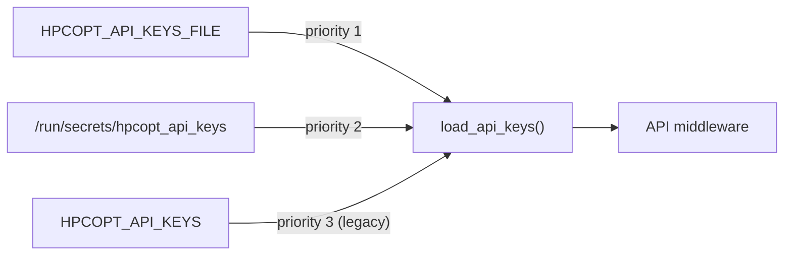

# Secrets Management Policy

## Architecture

API keys are loaded by `python/hpcopt/utils/secrets.py` via `load_api_keys()`, which checks three sources in priority order:

```text
1. HPCOPT_API_KEYS_FILE env var  -->  reads file (one key per line)
2. /run/secrets/hpcopt_api_keys  -->  Docker/K8s secret mount (auto-detected)
3. HPCOPT_API_KEYS env var       -->  comma-separated (legacy, logs warning)
```



### Key Properties

- **Per-request reload**: keys are re-read on every API request, enabling rotation without restart.
- **Comment support**: lines starting with `#` are ignored in key files.
- **Graceful degradation**: if the configured file is missing, an empty set is returned (auth disabled) with a warning logged.

## Rules

- No secrets in source control.
- Use file-based secret injection for API keys (preferred over environment variables).
- Docker deployments use `docker-compose.yaml` secrets block with file mount.
- Kubernetes deployments mount secrets at `/run/secrets/hpcopt_api_keys`.
- Rotate production secrets every 90 days or on incident.
- Legacy `HPCOPT_API_KEYS` env var is supported for backwards compatibility but triggers a deprecation log.

## Docker Setup

```yaml
# docker-compose.yaml
services:
  hpcopt:
    environment:
      HPCOPT_API_KEYS_FILE: /run/secrets/hpcopt_api_keys
    secrets:
      - hpcopt_api_keys

secrets:
  hpcopt_api_keys:
    file: ./secrets/api_keys.txt
```

Create the key file:

```bash
mkdir -p secrets
echo "production-api-key-1" > secrets/api_keys.txt
echo "production-api-key-2" >> secrets/api_keys.txt
```

## CI/CD

- Use repository/organization secret store only.
- Never print secret values in logs.
- Restrict secret access by workflow scope.
- Secret scanning runs in CI via `gitleaks`.

## Validation

- Secret scanning runs on every push/PR in CI.
- Bandit SAST scans Python code for security issues on every push/PR.
- Any leaked secret triggers immediate rotation and incident ticket.
- `tests/unit/test_secrets.py` validates all three loading paths.
